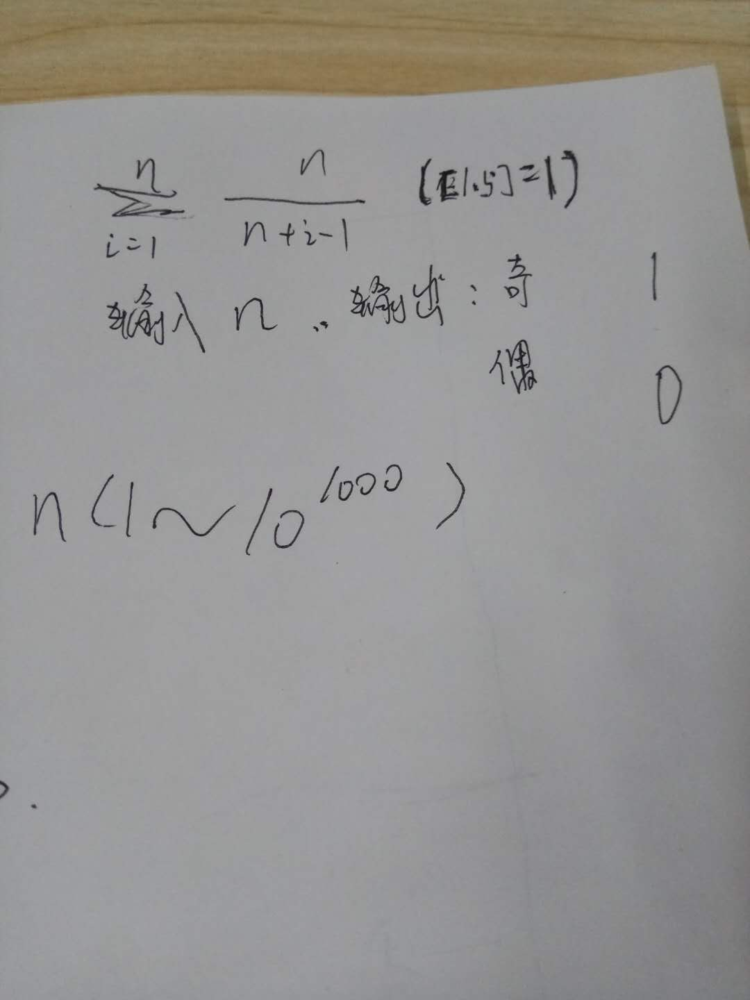

面试经验整理
======

面试结束时可以问如下问题：
------
公司最近在做哪些项目？

公司有没有内部培训？

公司涉及哪些业务？

贵公司比较看重哪些方便的技能？  
（以便知道哪些方面不足）

假如我能进入贵公司，面试的这个岗位主要做些什么？

当感觉自己没戏时，可以多问下自己有哪些不足，以及公司需要哪些方面的人才和技能。

睿×码×科×技：（余同学）
------
边缘检查怎么做？

你了解SVM吗？

池化层的反向传播？  
扩展：卷积的反向传播，

为什么用Adam优化器而不用其他的？  
扩展：优化器的选择

关于所写的项目经历：  
面试官一般都会深挖，比如你是怎么制作数据集的，多少用于训练，多少用于测试等；  
数据标注和分类如何实现？如果需要整理的数据非常大又如何办？  

×元×纯×语×义面经:（姚同学）
------
1.自我介绍，然后介绍一下所学的专业  
2.C++:在工作中什么时候会用到，怎么用函数的重载，重写，，，继承，多态，封装  
3.怎么进行C的内存管理  
4.对着笔试卷子一道道题目进行问，讲解原理，，快排的时间复杂度，是否稳定?为什么不稳定，稳定的定义是什么  
5.重述一遍Python比C++慢的原因，，，字节码和机器码有什么区别，字节码的定义是什么  
6.深度优先搜索  
7.用C++怎么实现滤波函数，滤波的原理  
8.手推反向传播函数，你平时用那些损失函数，，，全卷积的过程  
9.傅里叶变换和卷积的公式和推导  
10.C++几年编程经验，掌握了哪些设计模式，，，怎么把C代码部署到芯片上  
11.对opencv有哪些了解，怎么自己用C++实现分类器  

然后开始进入项目阶段  
12."你这个mtcnn就是一个demo，你对深度学习最擅长和了解的是哪个模块？"，，然后说了就会深问，，，我讲解了我用运动光流法做的人脸项目，，，后来又问了我另外一个项目，问项目里面某个模块的原理和细节  

最后就进入数学公式阶段，，，写了一道题两个求和符号的公式前半段，让我补齐后半部分，并证明推导，不记得了，，，这个结束后面试官出去又找了一道题让我写，英文的，等下我发题，大概3-5分钟思考，然后让先推导再编程实现

其它小问题也问了很多，，暂时想不起来了，感觉他们对C++和深度学习的要求挺高的.

中×兴×力×维×面经：（蒲同学）
------
1、自我介绍  
2、扣项目，实现流程，训练、检测流程，网络结构，有没我可以改进的地方，自己的想法  
3、YOLO,VGG,ResNet介绍，残差是怎么做的，为什么要这么做  
4、编程经验如何，有没有别的项目；  
5、平时如何学习，通过哪些途径，期望薪资  
其他随便聊一聊，全程40分钟左右吧  

还有batch norm如何做的，正则化如何做等问题吧  
希望能有帮助，也希望大家多多分享面经啊，齐心协力找到好工作  

金×瑞×麒×科×技面经：（姚同学）
------
问无人驾驶相关，  
深度学习相关的项目细节，  
使用过的某个神经网络的具体原理、算法公式，  
使用C++的熟练度，  
谈谈工作中遇到的一个具有挑战性的技术问题，怎么解决的，会问细节，  

这个是技术电话面试，面试官在国外，人力面都是一些无关痛痒的问题，聊期望薪资啥的，什么时候可以入职，为什么要从上一家公司离职，离职原因是什么

C++的面向对象的特性是什么？答案：封装、继承、多态。  
也没有多问什么，C++随便问了问就带过，主要问的还是深度学习和深度学习相关的项目经历，  
聊了聊我以前做过的软件开发相关的项目和没有用深度学习做的算法项目，面试官不太感兴趣，建议后期去面这家公司的同学，主要复习和准备深度学习的知识以及深度学习相关项目的细节，了解一点点C++基础知识就行，python没有问

哦，还有皓×图×智×能可能会背调上一家公司的情况，让留下上一家公司的上司、同事和朋友的联系方式

联×捷×计×算×科技（深×圳）有限公司（曾同学）
------
自我介绍（我主要介绍了以前的工作项目经历等，并说了说自己在培训期间学习了人工智能哪些方面的知识技能，做过哪些项目）；  
面试官 针对我简历上描述的项目提问  
他非常关注我做的 “自助面包付款系统” 项目，而且针对该项目提出如下些问题：  
  面包的数据集是怎么来的？（如果数据很多时如何处理等）  
  目前有多少数据？，多少用于训练，多少用于测试？  
  如何实现数据清洗等？  
  大小不同，长短不同的面包如何区分？（面试官提醒了我，可以用网络级联，先选出比较明显特征的面包，然后在处理其他相似的面包）  
  
面试官说： AlphaGo-五指棋 算法在网上都有很多，我想知道其中哪些是你自己实现的？  
问了下 MTCNN 架构实现。  

该公司框架使用和平台情况：  
主要使用 Tensorflow 和 Caffe框架，  
把Tensorflow移植到FPGA上，  

目前该公司涉及的项目：  
视频找人 -- 在监控视频中，根据一个人的属性，查找其出现的视频帧。  
利用神经网络自行标注样本等 -- 如人标注一部分，其余就交给神经网络来标注，最后人在检查一下即可。  

总结：  
基本没有问我以前的嵌入式工作经历，以及带队开发经历，个人感觉他们是在找 AI算法工程师 ，而不是招领导，所有个人技能还是需要多多加强。  
面试官一般都会深挖，比如你是怎么制作数据集的，多少用于训练，多少用于测试等；  
数据标注和分类如何实现？如果需要整理的数据非常大又如何办？  

成×都×晓×易×互×动科技有限公司
------
1. YOLO和Faster RCNN的区别？  为什么YOLO比Faster RCNN快？  YOLO有几个版本？
2. GAN怎么学习的？  有什么方法可以加快GAN网络的训练？
3. MTCNN的结构框图？
4. 说说自己了解的聚类算法？  什么是线性回归？
5. 面试官画了个二维坐标（一象限），并在一象限为画了些 x 和 o ，问支持向量机SVM是怎么找到分类超平面的。
